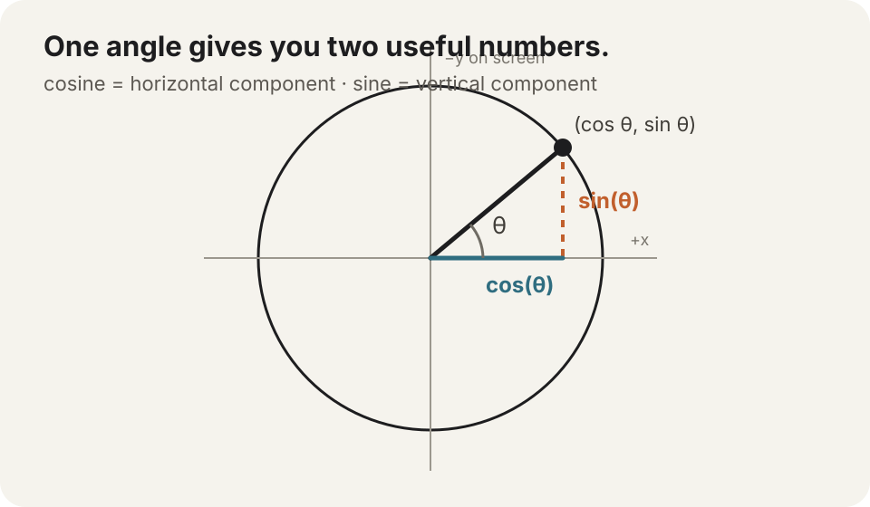

# Angles, sine, and cosine

Sine and cosine become much less mysterious when you stop treating them as school formulas and use them to move a dot around a circle.

One angle goes in. Two incredibly useful numbers come out.



## Radians are just another way to measure a turn

GraphX rotation uses radians, like Flutter's `Transform.rotate` and Dart's trigonometric functions.

A complete turn is:

```dart
GMath.tau
```

which is `2π` (about `6.28318`).

> **Why `tau`?** `τ` (tau) names the full-turn circle constant: circumference divided by radius, so `τ = 2π ≈ 6.283185…`. Bob Palais argued for using the full-turn constant in *π Is Wrong!* (2001), and Michael Hartl's [Tau Manifesto](https://www.tauday.com/tau-manifesto) popularized the symbol `τ` in 2010. Hartl chose `tau` partly because it echoes **turn**; he also notes the Greek root *tornos* (lathe/turning). In GraphX, `GMath.tau` is simply a readable way to say **one complete turn in radians**.

Half a turn:

```dart
GMath.pi
```

Quarter turn:

```dart
GMath.halfPi
```

If degrees are easier to read while authoring:

```dart
final angle = GMath.radians(45);
```

and back again:

```dart
final degrees = GMath.degrees(angle);
```

Nothing magical happened. Degrees say “360 pieces in a turn.” Radians say “`2π` pieces in a turn.”

Radians happen to fit the math of circles extremely well, which is why graphics/physics APIs tend to prefer them.

## Cosine gives the horizontal part

Take an angle and ask:

```dart
final x = GMath.cos(angle);
```

The answer always lives between `-1` and `1`.

At 0°:

```text
cos = 1
```

At 90°:

```text
cos = 0
```

At 180°:

```text
cos = -1
```

So cosine naturally tells you how far left/right a point on a unit circle sits.

## Sine gives the vertical part

```dart
final y = GMath.sin(angle);
```

That also ranges from `-1` to `1`.

In ordinary mathematical coordinates positive `y` points upward. On a Flutter/GraphX canvas positive `y` points downward.

So this perfectly normal screen-space orbit:

```dart
final x = centerX + GMath.cos(angle) * radius;
final y = centerY + GMath.sin(angle) * radius;
```

moves clockwise as `angle` increases.

If you want mathematical “counter-clockwise positive” motion on screen, flip the vertical component:

```dart
final y = centerY - GMath.sin(angle) * radius;
```

Neither convention is more correct. The important part is knowing which coordinate system you are looking at.

## Orbit something with four lines

```dart
double angle = 0;
final radius = 120.0;

@override
void update(double delta) {
  angle += GMath.radians(90) * delta;

  dot.setPosition(
    centerX + GMath.cos(angle) * radius,
    centerY + GMath.sin(angle) * radius,
  );
}
```

`90° per second` is converted to radians-per-second once, then multiplied by `delta` like any other velocity.

That is already enough for:

```text
orbiting particles
radar sweeps
circular menus
planet systems
loading indicators
camera shake components
```

## Direction from an angle

The pair:

```dart
final dx = GMath.cos(angle);
final dy = GMath.sin(angle);
```

is a unit direction.

Its length is 1.

Multiply by speed:

```dart
final vx = dx * speed;
final vy = dy * speed;
```

and it becomes velocity.

Multiply by radius:

```dart
final offsetX = dx * radius;
final offsetY = dy * radius;
```

and it becomes a point on a circle around some center.

Same numbers, different interpretation.

That is why vectors and trigonometry show up together so often in graphics code.

## `atan2` solves the opposite problem

Sometimes you do not have an angle. You have a direction toward something:

```dart
final dx = pointerX - ship.x;
final dy = pointerY - ship.y;
```

Ask for the angle:

```dart
final angle = GMath.atan2(dy, dx);
```

Now the ship can face the pointer:

```dart
ship.rotation = angle;
```

This is one of the most practical trig round-trips in creative coding:

```text
angle → cos/sin → direction

direction → atan2 → angle
```

## Sine also gives you a wave for free

A sine wave repeatedly travels from `-1` to `1` and back.

That makes it a tiny animation generator:

```dart
pulse.alpha = 0.75 + GMath.sin(stage.elapsed * 4) * 0.25;
```

or a bobbing motion:

```dart
icon.y = baseY + GMath.sin(stage.elapsed * 3) * 12;
```

No timeline is required for a motion that is naturally periodic.

The same idea can drive color, scale, rotation, blur, camera sway—anything represented by a number.

## `tau` can make circle math easier to read

For a full revolution over normalized progress `t`:

```dart
final angle = t * GMath.tau;
```

For eight evenly-spaced points:

```dart
final step = GMath.tau / 8;
```

This often reads more directly than repeatedly writing `2 * pi` when the concept is “one complete turn.”

`dart:math` remains perfectly valid. `GMath` simply keeps the most common creative-coding constants/helpers close to the rest of GraphX.

> **Go deeper:** [Math Is Fun's Interactive Unit Circle](https://www.mathsisfun.com/algebra/trig-interactive-unit-circle.html) lets you drag the angle and watch sine/cosine change live. [BetterExplained's intuitive trigonometry guide](https://betterexplained.com/articles/intuitive-trigonometry/) is a friendly next read if you want the idea to click before memorizing more formulas.
