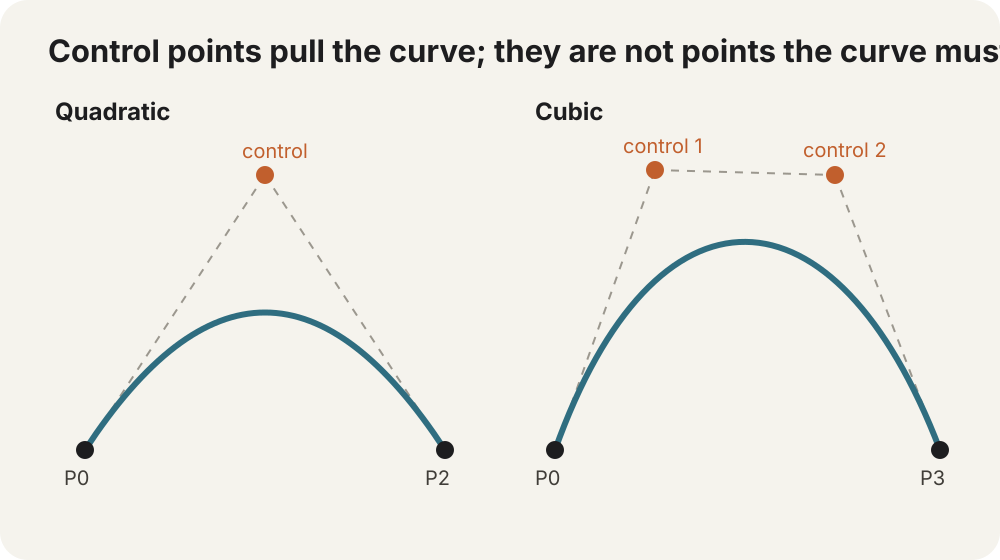

# Bézier curves

A straight line knows only where it starts and where it ends.

A Bézier curve adds one or two extra points that **pull** the path into shape.



## A control point is a magnet, not a waypoint

This GraphX path:

```dart
shape.graphics
    .moveTo(40, 220)
    .curveTo(
      180, 20,
      320, 220,
    );
```

creates a quadratic Bézier curve.

The arguments are:

```text
start point     → where the current path already is
control point   → pulls the curve
anchor/end      → where the curve finishes
```

The curve usually does **not** pass through the control point.

That is the first thing that makes Bézier handles feel strange if you expect every point to be a waypoint.

## Quadratic Bézier = lerp between lerps

The nicest way to understand the math is to reuse interpolation.

Call the three points:

```text
P0 = start
P1 = control
P2 = end
```

For some progress `t`, first interpolate along the two straight edges:

```dart
final ax = GMath.lerp(p0x, p1x, t);
final ay = GMath.lerp(p0y, p1y, t);

final bx = GMath.lerp(p1x, p2x, t);
final by = GMath.lerp(p1y, p2y, t);
```

Then interpolate **between those two moving points**:

```dart
final x = GMath.lerp(ax, bx, t);
final y = GMath.lerp(ay, by, t);
```

That final `(x, y)` lies on the quadratic Bézier.

So the curve is not a mysterious special shape. It is interpolation layered on top of interpolation.

At `t = 0`, everything collapses to `P0`.

At `t = 1`, everything collapses to `P2`.

Between them, the moving construction is pulled toward `P1`.

## Cubic curves get two handles

For more control:

```dart
shape.graphics
    .moveTo(40, 220)
    .cubicCurveTo(
      100, 20,
      260, 20,
      320, 220,
    );
```

A cubic Bézier has:

```text
P0 = start
P1 = first control
P2 = second control
P3 = end
```

The first control point strongly influences how the curve **leaves** the start.

The second strongly influences how it **arrives** at the end.

That makes cubic curves especially good for authored motion paths, logos, smooth connectors, and shape outlines.

## The tangent is hiding in the handles

At the very start of a cubic curve, the initial direction points from `P0` toward `P1`.

At the end, the arriving direction points from `P2` toward `P3`.

That gives a useful visual rule:

```text
move a handle sideways
        → change the curve's entering/leaving direction

move it farther away
        → increase how strongly it pulls the curve
```

You can often shape a curve correctly by eye before thinking about equations at all.

## GraphX paths sit on `dart:ui.Path`

As covered in [Paths](#paths), `GGraphics` retains native Flutter/Dart `Path` geometry.

`curveTo()` maps to the native quadratic Bézier operation.

`cubicCurveTo()` maps to the native cubic operation.

GraphX is not converting your curves into a separate proprietary path language before Canvas sees them.

That means the same conceptual curve math applies when you work directly with `dart:ui.Path` elsewhere in Flutter.

## Curves are geometry; motion along them is another problem

Drawing a Bézier path is one thing.

Moving an object along it at a constant-looking speed is more subtle because equal changes in `t` do **not** generally cover equal physical distance along the curve.

```text
t = 0.1 → 0.2
```

may travel a shorter or longer piece of the curve than:

```text
t = 0.7 → 0.8
```

That distinction introduces arc length, sampling, and tangents. [Following a path](#following-a-path) uses Flutter's native `PathMetric` API to turn those ideas into constant-speed motion and orientation.

If you can look at the control handles and predict roughly how the curve will bend, the important Bézier mental model is already in place.

> **Go deeper:** Pomax's free [Primer on Bézier Curves](https://pomax.github.io/bezierinfo/) is the rabbit hole to bookmark. Most diagrams are interactive, and it grows from the same control-point intuition into tangents, arc length, intersections, curvature, and much more.
