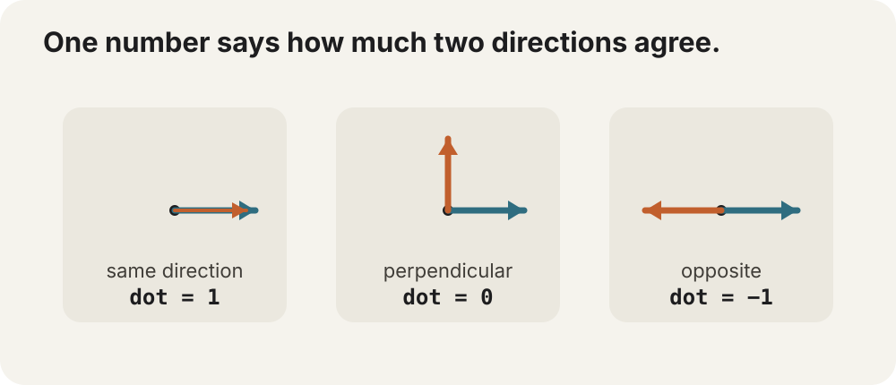

# Dot products without the scary name

You have two directions.

How much do they point the **same way**?

That is what a dot product answers.



## The formula is tiny

For two 2D vectors:

```text
A = (ax, ay)
B = (bx, by)
```

The dot product is:

```dart
final dot = ax * bx + ay * by;
```

Multiply horizontal with horizontal.

Multiply vertical with vertical.

Add them.

That is the whole arithmetic operation.

The interesting part is what the number means.

## Unit directions make the result easy to read

If both vectors have length `1`:

```text
dot =  1 → same direction
dot =  0 → perpendicular
dot = -1 → opposite direction
```

Values in between describe partial alignment.

For example, a dot near `0.9` means the two directions point mostly the same way.

A dot near `-0.9` means they point mostly against each other.

That turns a pair of arrows into one useful scalar.

## Is the target in front of me?

First get the object's facing direction from its rotation:

```dart
final facingX = GMath.cos(rotation);
final facingY = GMath.sin(rotation);
```

Then get a normalized direction toward the target:

```dart
final dx = target.x - x;
final dy = target.y - y;
final distance = GMath.hypo(dx, dy);

if (distance <= GMath.epsilon) return;

final targetX = dx / distance;
final targetY = dy / distance;
```

Now compare them:

```dart
final dot =
    facingX * targetX +
    facingY * targetY;
```

If:

```dart
if (dot > 0) {
  // target is somewhere in the forward half-plane
}
```

The entire 180° region in front of the object is one comparison.

No angle subtraction required.

## Make a field-of-view cone

Suppose an enemy should see only targets within 30° of its forward direction.

Compute the threshold once:

```dart
final threshold = GMath.cos(
  GMath.radians(30),
);
```

Then:

```dart
if (dot >= threshold) {
  enemySeesTarget();
}
```

Why cosine?

For unit vectors:

```text
dot = cos(angle between them)
```

So a 30° cone is equivalent to asking whether the directional agreement is at least `cos(30°)`.

That is one of those formulas that sounds abstract until you realize it is simply a visibility cone.

## “How much of this velocity goes along that direction?”

Suppose velocity is:

```dart
final velocityX = 140.0;
final velocityY = 60.0;
```

and `(normalX, normalY)` is a unit direction.

Project velocity onto it:

```dart
final along =
    velocityX * normalX +
    velocityY * normalY;
```

`along` is the signed amount of velocity in that direction.

Positive means with the direction.

Negative means against it.

Zero means entirely sideways.

That is why dot products appear in collision response, steering, camera constraints, lighting, and slope movement.

## Reflection is only one extra line

If `(normalX, normalY)` is a unit surface normal:

```dart
final towardNormal =
    velocityX * normalX +
    velocityY * normalY;

final reflectedX =
    velocityX - 2 * towardNormal * normalX;
final reflectedY =
    velocityY - 2 * towardNormal * normalY;
```

Now the velocity is mirrored across the surface.

That is the core geometry behind a perfectly elastic “bounce direction.”

A real physics response may also need restitution, friction, penetration correction, and continuous collision detection—but the directional reflection itself is just the dot product plus a normal.

## Why normalization matters

The friendly `-1..1` interpretation assumes both directions are unit length.

If one vector is twice as long, the dot product doubles too.

Sometimes that is useful because magnitude should participate.

When the question is purely:

> how aligned are these directions?

normalize them first.

That is why [Why Pythagoras keeps showing up](#why-pythagoras-keeps-showing-up) and this chapter are neighbors conceptually: Pythagoras gives you vector length; dividing by that length gives you the unit directions that make dot products easy to interpret.

## A tiny GraphX “vision cone” check

```dart
final facingX = GMath.cos(enemy.rotation);
final facingY = GMath.sin(enemy.rotation);

final dx = player.x - enemy.x;
final dy = player.y - enemy.y;
final distance = GMath.hypo(dx, dy);

if (distance > GMath.epsilon && distance < 240) {
  final targetX = dx / distance;
  final targetY = dy / distance;

  final dot =
      facingX * targetX +
      facingY * targetY;

  final visible = dot >= GMath.cos(
    GMath.radians(35),
  );

  enemy.tint = visible ? Colors.red : null;
}
```

Now three very small pieces work together:

```text
Pythagoras → distance / normalization
trigonometry → facing direction
 dot product → directional agreement
```

That combination is the beginning of a lot of game/interactive geometry.

## You can think “agreement,” not “dot product”

The name comes from vector algebra notation.

The useful mental shortcut in visual code is:

> **How much does direction A agree with direction B?**

Once that question feels natural, the formula becomes easy to recognize when it appears later in lighting, reflection, projection, cameras, collision response, and steering.

> **Go deeper:** [Math Is Fun — Dot Product](https://www.mathsisfun.com/algebra/vectors-dot-product.html) gives a short geometric refresher. For the deeper linear-algebra picture, 3Blue1Brown's [Dot products and duality](https://www.3blue1brown.com/lessons/dot-products) is much more visual than a formula-first treatment.
