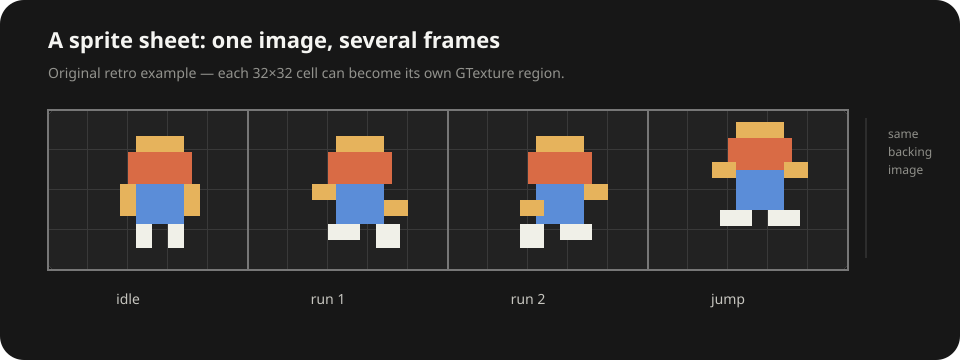

# Images and textures

Sooner or later, a scene needs actual pixels instead of vector geometry.

In GraphX, it helps to separate three ideas:

1. the decoded image data;
2. the texture that describes how that image data should be used;
3. the scene node that renders it.

That sounds more complicated than it is.

## `GImage` is the scene object

Once you have a `GTexture`, showing it is simple:

```dart
final image = root.addChild(GImage(texture));
image.setPosition(120, 80);
```

`GImage` is a normal GraphX node. It can be positioned, scaled, rotated, grouped, hidden, hit-tested, and composed just like the shapes we have already used.

The texture supplies the pixels. The node supplies the place those pixels live in the scene.

## A texture is a view of image data

Underneath, Flutter renders decoded image data as `dart:ui.Image`.

`GTexture` wraps that image with the extra information a retained scene often needs: logical scale, a frame region, trimming offsets, and whether the frame was rotated inside an atlas.

For a plain image, the relationship is straightforward:

```text
ui.Image  →  GTexture  →  GImage
pixels       image view    scene node
```

The separation matters because several scene nodes can share the same texture:

```dart
final a = root.addChild(GImage(texture));
final b = root.addChild(GImage(texture));

b.setPosition(120, 0);
b.scale = 0.5;
```

Both nodes render the same underlying image data while keeping independent transforms and scene state.

That is a common graphics-engine pattern and is different from thinking of every displayed image as owning a separate copy of its pixels.

## Loading one from Flutter assets

Most of the time you will not create `GTexture` objects by hand. The GraphX asset store can decode a Flutter asset for you:

```dart
Future<void> addPlayer(GRoot root) async {
  final texture = await root.stage.assets.texture('images/player.png');
  if (root.isDisposed) return;

  final player = root.addChild(GImage(texture));
  player.setPosition(160, 120);
}
```

A callback scene can kick that work off without turning the scene builder itself into an asset-management chapter:

```dart
GraphXView.scene((root) {
  addPlayer(root);
});
```

The `isDisposed` check matters because loading is asynchronous. The Flutter view may have gone away before the image finishes decoding.

[The shared asset store](#the-shared-asset-store) and the chapters after it cover bundle, memory, URL, `ImageProvider`, caching, and shared-runtime loading. Here, keep loading and displaying as separate concerns.

## Logical size and high-resolution assets

A texture can have a logical scale:

```dart
final texture = GTexture(image, scale: 2);
```

If the backing image is 200 × 100 pixels and the texture scale is `2`, GraphX treats it as 100 × 50 logical scene units.

That is useful for `2x`/high-density assets and generated captures where backing pixels and scene size should not be the same thing.

`GImage.width` and `GImage.height` report the texture's logical size, not necessarily the raw pixel dimensions of the backing `ui.Image`.

## One image can contain many textures

Spritesheets and texture atlases pack many images into one larger image.

The idea has a long history in 2D graphics. Early consoles did not use modern GPU texture atlases, but they were already built around reusing compact sprite and tile graphics instead of storing a separate full image for every thing on screen. Classic 8-bit platformers are an easy mental picture: a character was assembled or animated from a small collection of reusable graphic patterns.

Later, bitmap engines made that idea more literal with **sprite sheets**: several animation frames arranged inside one image. GPU-era 2D engines pushed it further into **texture atlases**, packing many unrelated sprites into one backing texture so renderers could avoid changing texture state as often and make batching easier.

Flash developers saw this pattern become especially important once Stage3D and engines such as Starling moved 2D content onto the GPU. The same idea became standard in mobile games and other real-time 2D engines: pack related graphics together, keep one backing texture around, and describe the individual pieces with rectangles and metadata.



*This is a modern illustration of the idea, not an NES hardware format. Each outlined frame can be treated as a region of the same backing image.*

A regular **sprite sheet** often uses predictable cells or manually arranged frames. A **texture atlas** is usually more general: sprites may be tightly packed, trimmed, or even rotated to waste less space, with metadata describing how to reconstruct their intended geometry.

A `GTexture` can describe just one region of that backing image:

```dart
final iconTexture = texture.region(
  region: GRect(32, 0, 32, 32),
);
```

The new texture still refers to the same underlying `ui.Image`; it simply describes a different frame.

GraphX also keeps frame metadata for trimmed and rotated atlas entries, so a `GImage` can recover the intended logical bounds rather than treating the packed rectangle as the whole object.

### `GTextureAtlas` gives those regions names

GraphX core also has a format-agnostic atlas container:

```dart
final atlas = GTextureAtlas(
  pages: [pageTexture],
  textures: {
    'player/idle': idleTexture,
    'player/run-1': run1Texture,
    'player/run-2': run2Texture,
  },
);
```

Look up a named region:

```dart
final playerTexture = atlas['player/idle'];
```

or safely:

```dart
final maybeTexture = atlas.find('player/idle');
```

The named entries are texture **views**. They may point at one atlas page or several pages, and each view can already contain trim/rotation/frame metadata.

`GTextureAtlas` deliberately does not understand TexturePacker JSON, Starling XML, Aseprite tags, or any other packer-specific file format. Decoder/helper packages can parse those formats and populate this small common container.

That keeps packer conventions out of GraphX core while giving render code one predictable result.

### Build a frame sequence from atlas names

If several named regions form an animation:

```dart
final run = atlas.sequence(
  [
    'player/run-1',
    'player/run-2',
  ],
  frameDuration: const Duration(milliseconds: 90),
);
```

The returned `GTextureSequence` borrows those atlas textures; it does not duplicate the backing image pixels.

Naming conventions and animation tags remain the decoder/application's decision. The atlas primitive only needs an explicit ordered list.

### Atlas ownership stays explicit

Named atlas entries are borrowed texture views whose lifetime follows their backing page/image.

By default:

```dart
GTextureAtlas(
  pages: pages,
  textures: textures,
)
```

does **not** dispose the page textures when the atlas wrapper is disposed.

If the atlas should own its backing pages:

```dart
final atlas = GTextureAtlas(
  pages: pages,
  textures: textures,
  ownsPages: true,
);
```

then disposing the atlas also disposes those page textures.

You do not need any of this machinery for ordinary PNGs. It becomes useful once many visual assets need named shared backing regions efficiently.

### Does an atlas automatically make GraphX faster?

Not by itself.

Historically, texture atlases have been a major rendering optimization because many GPU renderers can draw more sprites together when they share one texture, avoiding expensive texture switches and enabling larger batches.

GraphX²'s current Canvas renderer still paints each `GImage` through Flutter's canvas image APIs. Putting several `GImage` nodes on the same atlas does **not** magically collapse them into one draw call today.

The atlas is still useful: the nodes can share one backing `ui.Image`, asset packaging is compact, and trimmed/rotated frame metadata lets many sprites live efficiently in the same source image. It also preserves a representation that a future GPU/batched renderer can exploit without changing the scene model.

That distinction is worth remembering: **an atlas is a useful data layout; batching is a renderer optimization built on top of it.**

## Filtering

When an image is scaled, `filterQuality` controls how Flutter samples the texture:

```dart
image.filterQuality = FilterQuality.medium;
```

Lower filtering can be useful for pixel art or when you want the cheapest sampling path. Higher filtering can look smoother when an image is scaled.

There is no universal best choice; it depends on the artwork and how it is being transformed.

## Animated images

GraphX also has `GTextureSequence` and `GAnimatedImage` for timed frame sequences.

A decoded GIF or WebP can become a texture sequence, but the format is intentionally general enough for atlas animations or manually-authored frame clips too.

```dart
final sequence = await root.stage.assets.textureSequence(
  'images/loader.gif',
);
if (root.isDisposed) return;

final loader = GAnimatedImage(sequence);
loader.play();
root.addChild(loader);
```

`GAnimatedImage` is still just a node. Playback changes which texture is rendered over time; transforms, hierarchy, alpha, visibility, and interaction continue to work in the usual GraphX way.

The [Assets](#the-shared-asset-store) chapters go deeper into loading, caching, ownership, shared runtimes, and network images. Here the distinction is smaller:

**`GTexture` is reusable image data; `GImage` is the thing that lives in your scene.**
