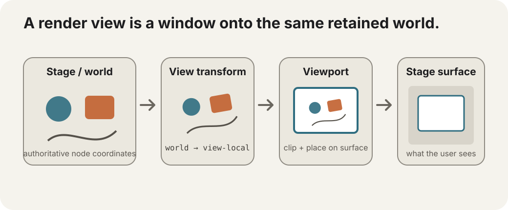

# Multiple views

A `GRenderView` is easiest to understand if we **do not start with cameras**.

Think of it as a **window onto the same retained stage**.

The nodes stay exactly where they are in world/stage coordinates. A render view decides how that world is transformed, clipped, and placed onto the GraphX surface for one render pass.



## A render view is two pieces

```text
transform  → world coordinates → view-local coordinates
viewport   → where that transformed picture is clipped/placed on the stage surface
```

That is the complete core idea.

A view does **not** own another scene tree. It does not move nodes. It does not have follow behavior, shake, dead zones, or gameplay notions of a camera target.

It is a retained description of **how to look at the stage for this pass**.

## The ordinary stage already behaves like an identity view

If you never touch `stage.renderViews`, GraphX uses its normal single-pass renderer:

```text
world coordinates
      ↓ identity mapping
whole GraphX surface
```

So explicit render views are not required for a normal GraphX scene.

You opt into them when one retained world needs a different mapping or needs to appear more than once.

## One world, two windows

An editor might show the document at full size and also show a small navigator in the corner.

Both are the **same retained nodes**.

```text
stage world
   ├── main view      → large viewport
   └── navigator view → small viewport, zoomed out
```

Create the main window:

```dart
final mainView = GRenderView(
  viewport: GRect(
    0,
    0,
    stage.width,
    stage.height,
  ),
  transform: GMatrix2(),
);
```

And a small navigator:

```dart
final navigator = GRenderView(
  viewport: GRect(20, 20, 180, 120),
  transform: GMatrix2(
    0.2,
    0,
    0,
    0.2,
    0,
    0,
  ),
);
```

Register both:

```dart
stage.renderViews.add(mainView);
stage.renderViews.add(navigator);
```

Once explicit render views exist, GraphX renders through those registered views instead of also performing the implicit identity pass.

So if you add only the navigator, you get only the navigator.

## Why people call this a camera

A camera is one very common way to *control* a render view.

Suppose the conceptual camera position is:

```dart
final cameraX = 300.0;
final cameraY = 180.0;
```

If the camera moves right, the world should appear to move left. At the simplest translation-only level:

```dart
mainView.transform.tx = -cameraX;
mainView.transform.ty = -cameraY;
mainView.invalidate();
```

That is why camera code often looks “backwards”: the render transform maps **world → view**, so moving the observer right means translating world pixels left.

But notice what core GraphX actually stores:

```text
not: cameraX, cameraY, target, deadZone, shake...

but: one world→view matrix
```

The word **camera** is therefore a useful metaphor for the behavior driving that matrix, not the definition of `GRenderView` itself.

## Three different ways to create camera-like motion

This distinction is useful because GraphX supports more than one architecture.

### 1. Move a world node

For a simple scene, you can put everything under a `world` node and move/scale that node:

```dart
world.setPosition(-cameraX, -cameraY);
world.scale = zoom;
```

That is completely valid.

It is easy to understand and works well when there is one view of the world.

The trade-off is that the “camera” becomes part of the retained node transform hierarchy itself. If you want the same world rendered twice with two different camera transforms, one node transform cannot represent both simultaneously.

### 2. Use `GRenderView` directly

Keep the world coordinates untouched and put the viewing transform in the render pass:

```dart
mainView.transform.tx = -cameraX;
mainView.transform.ty = -cameraY;
mainView.invalidate();
```

Now another `GRenderView` can render those exact same nodes through a completely different transform.

That is the core feature needed for:

```text
minimap / navigator
split screen
picture-in-picture
editor overview
multiple simultaneous viewpoints
```

### 3. Let a camera package drive the view

A higher-level camera package can own concepts such as:

```text
follow target
dead zone
world bounds
smooth follow
zoom policy
shake
look-ahead
coordinate helpers
```

and ultimately update the same retained `GRenderView.transform`.

That package is adding **camera behavior**, not replacing the render-view primitive.

So learning `GRenderView` is still useful even when you normally use a camera helper: it tells you what the camera package is driving underneath.

## `viewport` is not the camera rectangle in the world

This is an easy confusion.

`viewport` describes a rectangle on the **GraphX output surface**:

```dart
GRect(20, 20, 180, 120)
```

means:

> draw this view at x=20, y=20, sized 180×120 on the GraphX surface.

It does **not** mean “look at world rectangle 20,20→200,140.”

Which part of the world appears inside that rectangle comes from `transform`.

A useful mental model is:

```text
viewport = where is the window?
transform = what does the world look like through it?
```

## World coordinates remain authoritative

This is one of the strongest reasons to separate views from node transforms.

Suppose a scene object is at:

```dart
object.setPosition(800, 500);
```

It remains at `(800, 500)` regardless of whether:

```text
main view is zoomed to 200%
navigator is zoomed to 15%
a second split-screen view is rotated
```

Each view maps that authoritative world position into a different output position.

The scene does not need duplicate node coordinates for every observer.

## Convert explicitly between world and stage surface

A `GRenderView` exposes the mapping directly:

```dart
final screenPoint = mainView.worldToStage(
  object.x,
  object.y,
);
```

and back:

```dart
final worldPoint = mainView.stageToWorld(
  pointerX,
  pointerY,
);
```

That pair is a very literal description of what a render view does.

```text
worldToStage() → where does this world point appear through this window?
stageToWorld() → what world point is underneath this surface position?
```

If `stageToWorld()` returns `null`, the matrix could not be inverted.

## Input uses the same view, not a separate camera model

Pointer coordinates arrive in stage-surface space.

With explicit views active, GraphX checks registered views from front to back, finds the top-most enabled/input-enabled viewport under the pointer, and maps the point through that view's inverse transform before normal scene hit testing.

So the navigator can be interactive while still referring to the exact same retained nodes as the main view.

The routed node event also knows which `GRenderView` produced that interaction.

Disable input when a view is visual only:

```dart
navigator.inputEnabled = false;
```

## View order is explicit

Views paint in collection order.

```dart
stage.renderViews.bringToFront(navigator);
```

or:

```dart
stage.renderViews.sendToBack(navigator);
```

When viewports overlap, that ordering also matters for input because GraphX searches from front to back for the top-most eligible view under the pointer.

## Different windows can show different retained branches

Sometimes the navigator should show document geometry but not editor chrome/HUD overlays.

`GRenderMask` and `GRenderGroup` let an explicit view cheaply select coarse retained branches:

```dart
final worldMask = GRenderMask.bit(0);
final hudMask = GRenderMask.bit(1);

final world = root.addChild(
  GRenderGroup(mask: worldMask),
);

final hud = root.addChild(
  GRenderGroup(mask: hudMask),
);
```

Then:

```dart
mainView.mask = worldMask | hudMask;
navigator.mask = worldMask;
```

A rejected `GRenderGroup` lets traversal skip the whole subtree with one mask check.

That is another clue that `GRenderView` is broader than a camera: it describes an explicit rendering pass over the retained stage, including which coarse branches participate.

## Resize means updating the window you own

Explicit viewport rectangles are retained mutable objects.

If the main view should continue covering the whole GraphX surface after resize:

```dart
@override
void resize(double width, double height) {
  mainView.viewport.x = 0;
  mainView.viewport.y = 0;
  mainView.viewport.w = width;
  mainView.viewport.h = height;
  mainView.invalidate();
}
```

Likewise, direct in-place edits to `transform` require `invalidate()` so GraphX can repaint and reconcile input mapping.

## The compact definition

If “camera” starts making the concept fuzzier, come back to this:

```text
GRenderView
  = viewport rectangle on the GraphX surface
  + world → viewport-local transform
  + optional render mask / input participation
```

A camera can drive it.

A minimap can use it.

A split screen can use it.

An editor navigator can use it.

The retained world does not have to know which one you meant.
