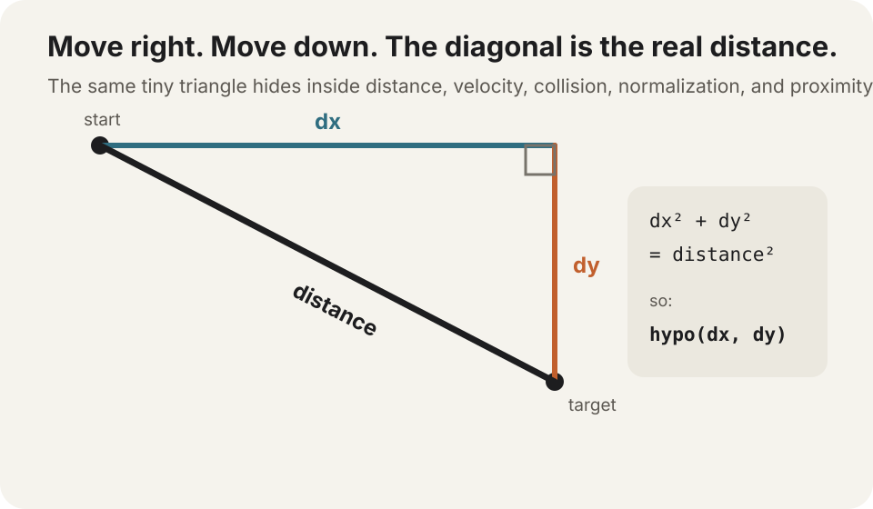

# Why Pythagoras keeps showing up

You move `120` pixels to the right and `50` pixels down.

How far did you *actually* travel?

Not `170` pixels. That would mean walking the two legs separately.

The straight-line distance is the diagonal:

```text
130 pixels
```

That tiny question is why Pythagoras appears everywhere in graphics code.



## The theorem is just a distance machine

For a right triangle:

```text
a² + b² = c²
```

In screen coordinates those letters are usually more useful as:

```text
dx² + dy² = distance²
```

So:

```dart
final distance = GMath.hypo(dx, dy);
```

`hypo()` is simply the convenient form of:

```dart
final distance = GMath.sqrt(
  dx * dx + dy * dy,
);
```

You do not need to keep thinking “Pythagorean theorem” every time you use it.

The practical mental model is smaller:

> **two perpendicular components → one straight-line magnitude**

That pattern is everywhere.

## Distance between two points

Two objects sit at different positions:

```dart
final dx = enemy.x - player.x;
final dy = enemy.y - player.y;

final distance = GMath.hypo(dx, dy);
```

Now you can ask:

```dart
if (distance < 120) {
  enemyWakeUp();
}
```

Same theorem. The triangle is simply invisible in the code.

## Speed from horizontal and vertical velocity

Suppose an object has:

```dart
final velocityX = 120.0;
final velocityY = 50.0;
```

Its actual speed is not `170`.

```dart
final speed = GMath.hypo(
  velocityX,
  velocityY,
);
```

which gives `130` units per second.

So the exact same triangle can describe **space** or **velocity**:

```text
(dx, dy)       → distance
(vx, vy)       → speed
(ax, ay)       → acceleration magnitude
```

The math only sees two perpendicular components.

## Normalization depends on that length

Earlier we normalized a direction like this:

```dart
final length = GMath.hypo(dx, dy);

final nx = dx / length;
final ny = dy / length;
```

Why divide by that number?

Because Pythagoras told us the vector's current length.

Dividing both components by the length shrinks the diagonal to exactly `1` while preserving its direction.

That gives us a unit vector.

So normalization is not a separate math trick. It is:

```text
1. find the diagonal length
2. divide the two components by it
```

## Diagonal keyboard movement exposes the same problem

This common movement code has a subtle bug:

```dart
var dx = 0.0;
var dy = 0.0;

if (keyboard.isDown(GKey.arrowRight)) dx += 1;
if (keyboard.isDown(GKey.arrowDown)) dy += 1;

x += dx * speed * delta;
y += dy * speed * delta;
```

Press only Right:

```text
vector = (1, 0)
length = 1
```

Press Right + Down:

```text
vector = (1, 1)
length = √2 ≈ 1.414
```

So diagonal movement is about **41% faster**.

Normalize before applying speed:

```dart
final length = GMath.hypo(dx, dy);

if (length > GMath.epsilon) {
  dx /= length;
  dy /= length;
}

x += dx * speed * delta;
y += dy * speed * delta;
```

Now every direction has the same magnitude.

That little bug is one of the nicest ways to *feel* why vector length matters.

## Circle collision is Pythagoras without the square root

Two circles overlap when the distance between their centers is smaller than their combined radii.

We could write:

```dart
final distance = GMath.hypo(dx, dy);
final collided = distance <= radiusA + radiusB;
```

But for a yes/no comparison, square both sides instead:

```dart
final radius = radiusA + radiusB;

final collided =
    dx * dx + dy * dy <= radius * radius;
```

No square root needed.

The theorem did not disappear. We simply stopped one step earlier:

```text
dx² + dy² = distance²
```

and compared squared distances directly.

## Tangents and normals use it too

Suppose a path tangent gives us:

```dart
final dx = tangent.vector.dx;
final dy = tangent.vector.dy;
```

To turn that into a clean unit direction:

```dart
final length = GMath.hypo(dx, dy);
final tx = dx / length;
final ty = dy / length;
```

Then a perpendicular normal is:

```dart
final nx = -ty;
final ny = tx;
```

Again the first step is finding the diagonal magnitude.

Path following, steering, lighting math, reflection, collision response—this little operation keeps returning because 2D graphics is full of horizontal + vertical components that need to become one magnitude.

## A tiny GraphX experiment

The easiest way to make the theorem stop feeling abstract is to let the pointer create the triangle.

```dart
GraphXView.scene((root) {
  const originX = 180.0;
  const originY = 140.0;

  final triangle = root.addChild(GShape());

  final marker = root.addChild(GShape());
  marker.graphics
      .beginFill(Colors.orange)
      .drawCircle(0, 0, 6)
      .endFill();

  final label = root.addChild(
    GText(
      '',
      style: const TextStyle(
        fontSize: 14,
        color: Colors.black,
      ),
    ),
  );

  void updateTriangle(double x, double y) {
    final dx = x - originX;
    final dy = y - originY;
    final distance = GMath.hypo(dx, dy);

    triangle.graphics
        .clear()
        .lineStyle(2, Colors.blueGrey)
        .moveTo(originX, originY)
        .lineTo(x, originY)
        .lineTo(x, y)
        .lineTo(originX, originY)
        .endStroke();

    marker.setPosition(x, y);
    label.text = '${distance.round()} px';
    label.setPosition(x + 12, y - 12);
  }

  root.stage.pointer.onEvent.add((event) {
    if (!event.isMove && !event.isHover) return;
    updateTriangle(event.x, event.y);
  });
});
```

Move horizontally: the distance matches `dx`.

Move vertically: it matches `dy`.

Move diagonally: now the straight-line number has to combine both.

This tiny experiment is already enough to make the relationship visible. A future Manual/Labs version can make it more playful with live `dx` / `dy` labels, colored legs, and a draggable origin.

## You do not need to love math vocabulary

You only need to recognize the recurring shape:

```text
horizontal amount
vertical amount
        ↓
straight-line magnitude
```

Whenever that question appears, Pythagoras is probably nearby.

That is why a theorem from school keeps showing up in animation, games, editors, particles, steering, hit testing, cameras, and creative coding in general.

> **Go deeper:** [Math Is Fun — Pythagoras' Theorem](https://www.mathsisfun.com/pythagoras.html) is a short visual refresher if you want to play with the triangle itself before coming back to vectors and motion.
