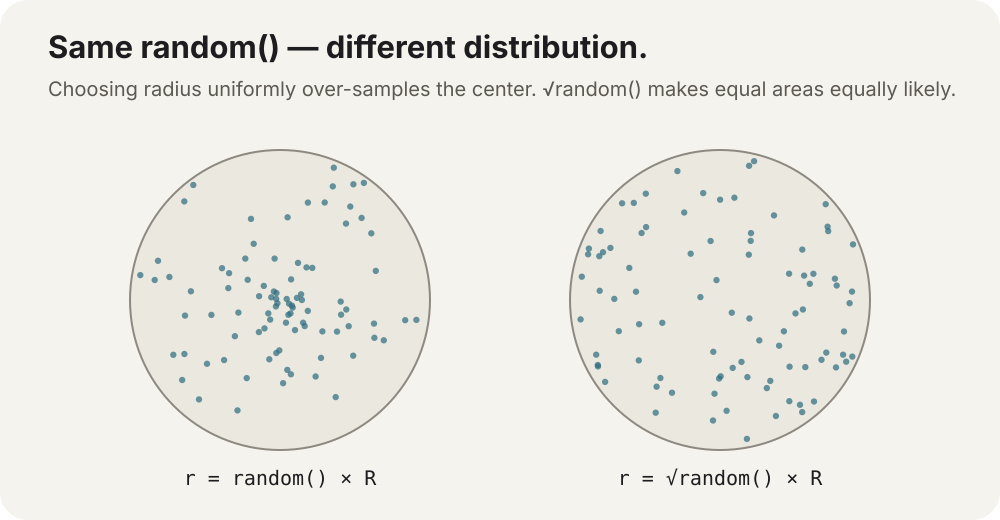

# Randomness that feels intentional

`random()` is easy.

Making randomness look good is where things get interesting.

A uniform random number from `0` to `1` can become position, angle, scale, color, probability, or motion—but the way you transform it determines the **distribution** people actually see.

## GraphX starts with `0..1`

```dart
final r = GMath.random();
```

`r` is uniformly distributed from `0` inclusive to `1` exclusive.

That small range is enough because we already know how to map ranges:

```dart
final x = GMath.lerp(40, 360, GMath.random());
```

Now `x` is uniformly distributed between `40` and `360`.

The same idea works for size:

```dart
final scale = GMath.lerp(0.5, 1.5, GMath.random());
```

or opacity:

```dart
final alpha = GMath.lerp(0.2, 1.0, GMath.random());
```

This is another reason normalized `0..1` values are such a convenient lingua franca in creative coding.

## Pick one discrete option

Choose an index:

```dart
final index = GMath.floor(
  GMath.random() * choices.length,
).toInt();
```

Then:

```dart
final choice = choices[index];
```

Because `GMath.random()` never reaches `1.0`, the result stays between `0` and `length - 1`.

For occasional application logic, Dart's own `Random.nextInt()` is equally valid and often clearer. `GMath.random()` is mainly convenient when the rest of the visual math already lives in normalized doubles.

## A random angle is one full turn

```dart
final angle = GMath.random() * GMath.tau;
```

That is a uniform direction around a circle.

Turn it into a direction vector:

```dart
final dx = GMath.cos(angle);
final dy = GMath.sin(angle);
```

or a velocity:

```dart
final speed = 180.0;
final velocityX = dx * speed;
final velocityY = dy * speed;
```

Now a particle can leave an explosion in any direction with equal angular probability.

## Random point on a circle

For a point exactly on the circumference:

```dart
final angle = GMath.random() * GMath.tau;

final x = centerX + GMath.cos(angle) * radius;
final y = centerY + GMath.sin(angle) * radius;
```

Every angle has the same chance.

That is good for rings, radial emitters, orbital spawn points, and circular menus.

## Random point *inside* a circle has a trap

This looks reasonable:

```dart
final angle = GMath.random() * GMath.tau;
final r = GMath.random() * radius;
```

but it produces too many points near the center.

Why?

A thin ring near the outer edge contains much more **area** than a thin ring near the center, but the naïve code gives both radial intervals equal probability.



For roughly uniform density across the circle area:

```dart
final angle = GMath.random() * GMath.tau;
final r = GMath.sqrt(GMath.random()) * radius;

final x = centerX + GMath.cos(angle) * r;
final y = centerY + GMath.sin(angle) * r;
```

The square root compensates for the fact that circle area grows with `r²`.

That is a lovely creative-coding lesson: **uniform random inputs do not guarantee a visually uniform result after geometry transforms them.**

## Probability is just a threshold

A 10% chance:

```dart
if (GMath.random() < 0.10) {
  spawnSpark();
}
```

A 65% chance:

```dart
if (GMath.random() < 0.65) {
  playVariant();
}
```

The probability itself is already normalized `0..1`, so the comparison reads almost exactly like the sentence.

## Bias randomness deliberately

Uniform randomness often looks noisy rather than natural.

Want small values more often?

```dart
final r = GMath.random();
final biased = r * r;
```

Squaring pushes more results toward `0`.

Want larger values more often?

```dart
final biased = GMath.sqrt(GMath.random());
```

Now more results sit toward `1`.

That same tiny idea can control:

```text
particle size
spawn distance
brightness
speed
lifespan
variation strength
```

The function you pass randomness through becomes the distribution's personality.

## Random is not noise

If you choose a fresh independent random value every frame:

```dart
x = GMath.random() * stage.width;
```

the object jitters violently because each sample has no relationship to the previous one.

Smooth organic wandering usually needs a **correlated** signal—noise, filtered randomness, a random acceleration model, or a random target followed with smoothing/springs.

That is a different concept from uniform random sampling.

The distinction is important because “make it random” and “make it feel organic” are not the same request.

## Deterministic simulations need their own RNG

`GMath.random()` uses an internal ordinary Dart `Random` and does not expose a seed/control surface.

That is convenient for visual variation, but not appropriate when you need exact replayability:

```text
lockstep simulation
record/replay
golden tests
procedural generation from a known seed
```

For that, own the generator explicitly:

```dart
import 'dart:math' as math;

final random = math.Random(42);

final x = random.nextDouble() * 400;
```

Now the seed is part of your simulation state instead of hidden global convenience state.

That is another recurring GraphX principle: use the small convenience primitive when it matches the problem; drop to the standard Dart tool when you need its extra control.

> **Go deeper:** Daniel Shiffman's free [Nature of Code — Randomness](https://natureofcode.com/random/) goes much further into random walks, biased distributions, Gaussian randomness, accept/reject sampling, and the important difference between randomness and smooth noise.
